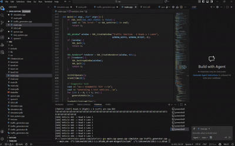

# Traffic Junction Simulator
**Data Structures & Algorithms (COMP202) | Assignment #1**

**Submitted by:** Aayush Acharya  
**Roll No:** 01  
**Date:** DEC 2025

---
* [Read Full Technical Report](./REPORT.md) and [View DSA Report (PDF)](assets/DSA%20Report.pdf)


## Summary of Work
This project simulates a central traffic junction where four major roads (A, B, C, D) meet. The system is designed to manage 12 lanes using a custom **Queue** data structure. 

The simulator handles two primary modes:
* **Normal Condition:** Vehicles are served fairly based on the average occupancy of waiting lanes.
* **High-Priority Condition:** If the priority lane (**AL2**) accumulates more than 10 vehicles, it is prioritized until the count drops below 5.

## Simulation Demo
The simulation video is available in the repository. Due to file size, GitHub may not play it directly in the browser.


*This video demonstrates the SDL3 interface, the traffic generation logic, and the priority handling for lane AL2.*

---

## System Objectives
* Implement a linear data structure to solve a real-world traffic problem.
* Visualize the queue management system using SDL3.
* Establish communication between a `traffic_generator` and a `simulator` via file sharing.

## Data Structure Table
| Data Structure | Implementation | Purpose |
| :--- | :--- | :--- |
| **Vehicle Queue** | Circular Array | Maintains the list of vehicles waiting in each of the 12 lanes. |
| **Lane/Light Queue** | Priority Logic | Updates the serving order if AL2 exceeds the 10-vehicle threshold. |
| **Vehicle Struct** | Custom Object | Stores unique Vehicle IDs, road labels, and lane numbers. |


---
---

##  Algorithm & Complexity
* **Queue Operations:** Enqueue and Dequeue are **$O(1)$** as they use head/tail pointers in a circular array.
* **Traffic Processing:** The simulator checks lanes in **$O(n)$** time, where $n$ is the number of lanes (12).
* **Space Complexity:** **$O(N \times L)$**, where $N$ is the max queue size and $L$ is the number of lanes.
## Process to Run

### 1. Compile the Program
Open your terminal in the `src` directory and run:
```bash
g++ main.cpp queue.cpp -o main.exe -I"C:\SDLnew\SDL\SDL3-3.2.28\x86_64-w64-mingw32\include" -L"C:\SDLnew\SDL\SDL3-3.2.28\x86_64-w64-mingw32\lib" -lSDL3 -lmingw32 -mconsole
 
